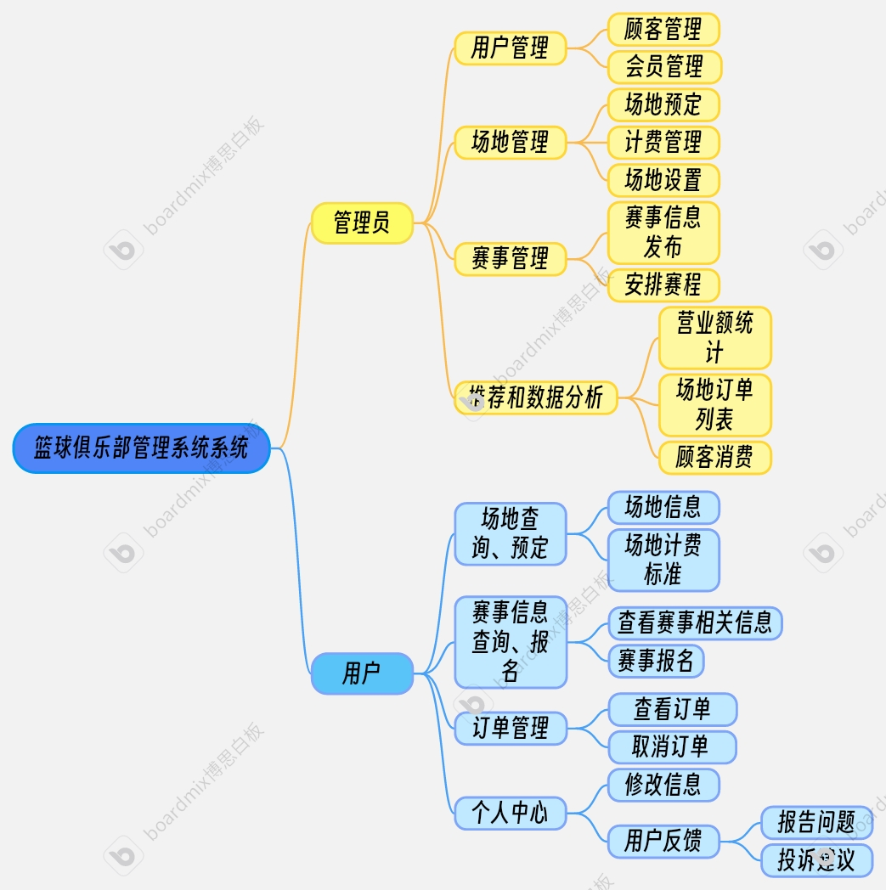
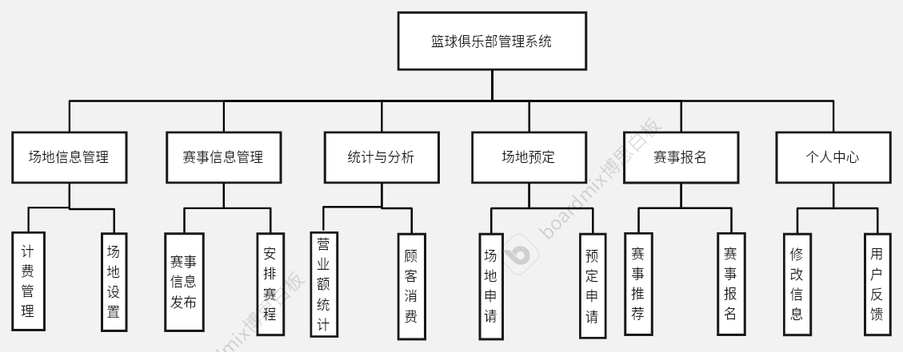

[toc]

# 篮球俱乐部管理项目 (BasketClub) 前端项目

[后端项目](https://github.com/hhsmantou/Basketball_club-/tree/main)

2025/02/28 create

项目期限：2025/03/20

数据库在 **03/10** 之前完成，需要写数据库设计说明

logo:solar:basketball-bold-duotone

<b>系统流程图</b>

<b>系统模块划分</b>

## 功能需求

### 前台 (用户端)

>   [!tip]
>
>   **适用角色**：普通用户、会员用户
>   **目标**：提供场地预约、赛事报名、个人管理等功能

*   用户
    *   用户的登录注册
    *   用户信息更改
    *   购买会员、会员充值
    *   投诉、报告问题
*   场地
    *   查看场地列表(所有可预约场地)
    *   查看场地详情(图片、价格、可用时间)
    *   预约场地(选择日期、时间段、支付)
    *   查看/取消预约
*   赛事
    *   浏览赛事信息(赛事名称、时间、报名状态)
    *   报名比赛、支付报名费/免费报名
    *   查看赛程安排
    *   查看赛事成绩
    *   赛事推荐，根据用户浏览量在主页推荐
*   订单和支付
    *   场地预约支付、相关商品支付、使用积分支付
    *   会员充值支付（根据会员等级设置优惠、满减、打折）
    *   赛事报名支付，会员可以使用积分兑换
    *   订单查询
*   周边商品
    *   查看和购买、会员可以累计积分（根据会员等级设置积分兑换）

### 后台 (管理端)

>   [!tip]
>
>   **适用角色**：管理员
>   **目标**：管理场地、用户、预约、赛事，并提供数据分析支持

*   用户管理
    *   查询用户列表
    *   修改用户、删除用户
    *   编辑用户信息
*   场地管理
    *   添加、编辑场地（名称、图片、价格、计费规则）
    *   场地开放时间 （可预约时间段）
    *   场地使用情况 （预约率、空闲率）
*   预约管理
    *   查看所有预约（用户、时间、场地）
    *   取消预约
*   赛事管理
    *   创建赛事（赛事名称、赛事规则、安排时间）
    *   审核参赛选手
    *   管理赛程安排 （自动/手动）
    *   发布比赛通知
*   订单和财务
    *   订单管理（场地预约、赛事报名、充值订单）
    *   退款处理（用户取消预约、赛事退款）
*   数据分析
    *   用户数据统计（用户数量、活跃用户数量）
    *   场地预约统计（热门场地、闲置率）
    *   赛事参与数据（报名人数）
    *   营收数据（场地收入、会员充值、赛事收入）
*   投诉和问题
    *   查看投诉列表
    *   查看报告问题列表
